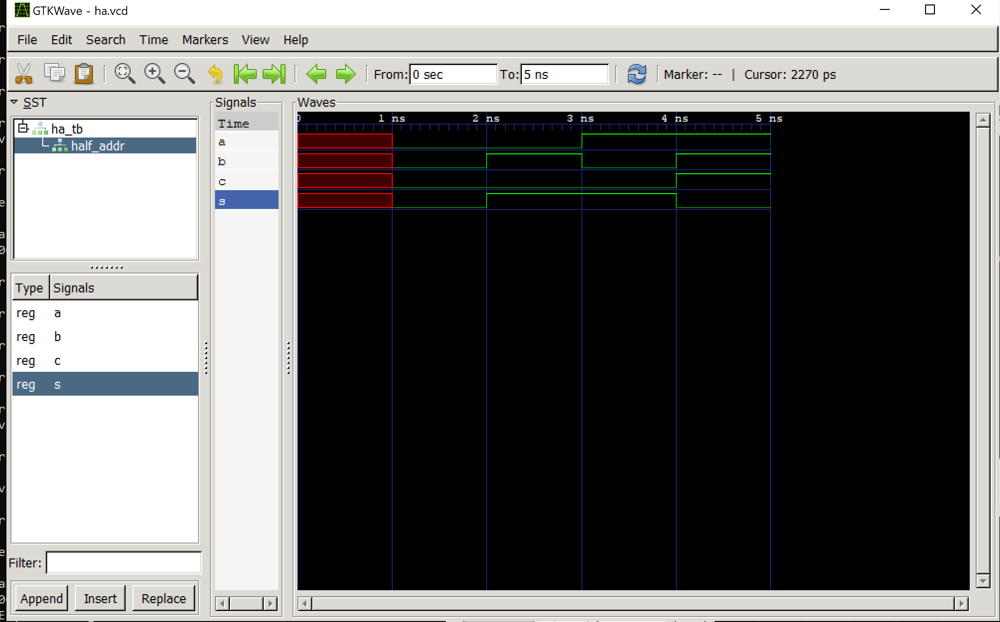

#Lab 1

>Students were tasked with downloaading GHDL and GTKWave and utilize those >programs to run the half adder example and D flip-flop example. Below are the >results of executing those examples

---

**Half Adder**

