# Lab 10

**Run hash_value.py twice and compare results**
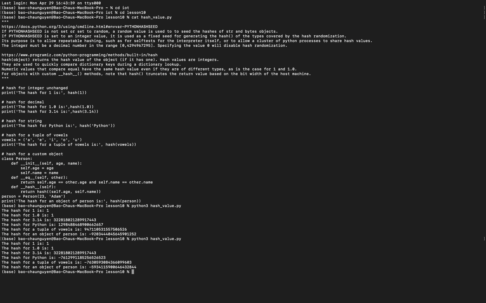

**SHA-2 Secure Hash Algorithm**
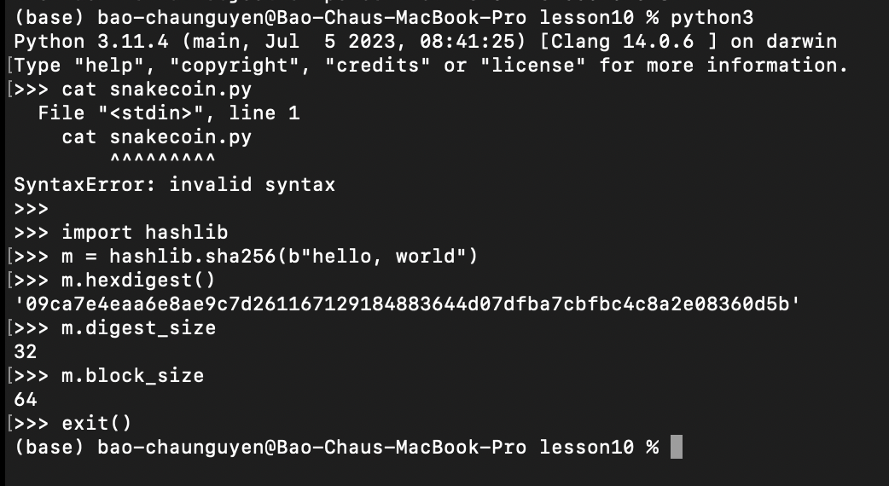

**Build the tiniest blockchain in less than 50 lines of Python by Gerald Nash (2017-07-16)**

*cat snakecoin.py*
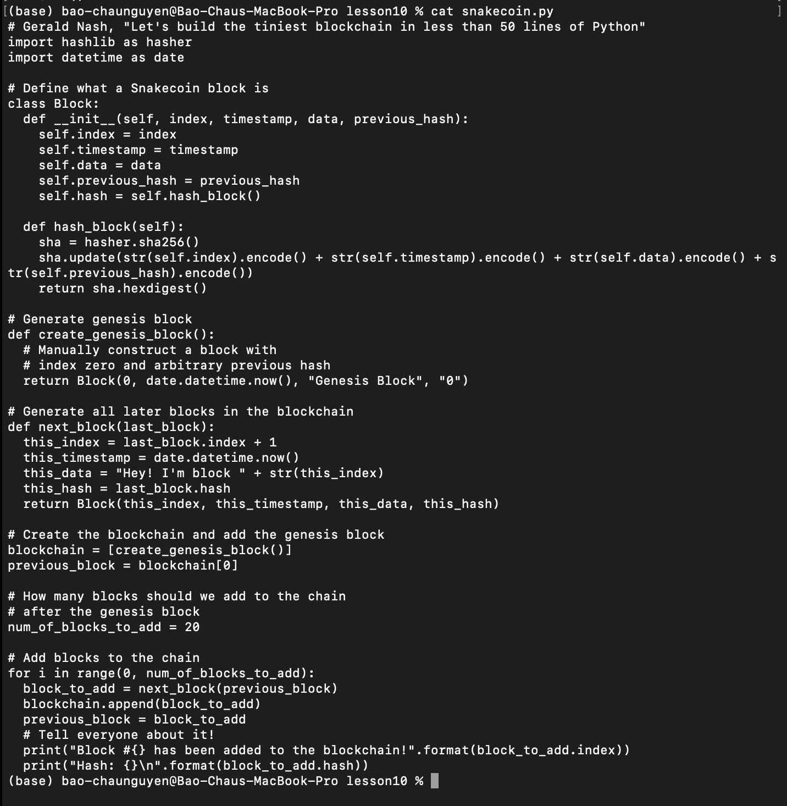

*python3 snakecoin.py*
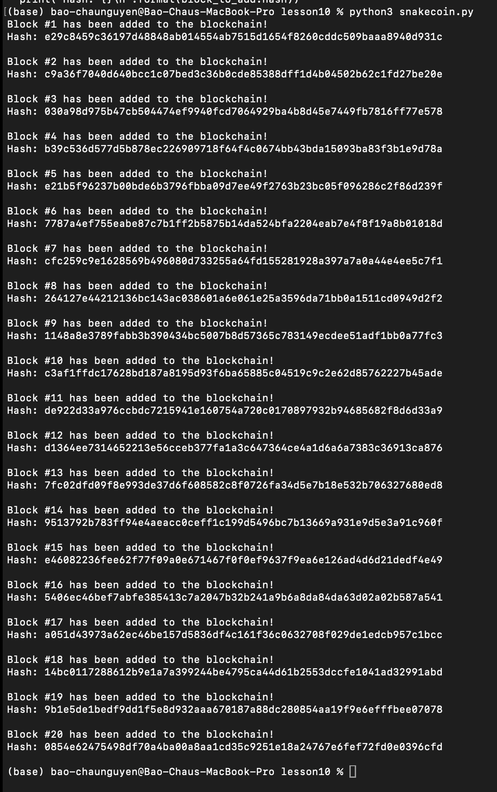

**Let’s Make the Tiniest Blockchain Bigger Part 2: With More Lines of Python by Gerald Nash (2017-07-23)**

*Terminal 1*

*cat snakecoin-server-full-code.py*
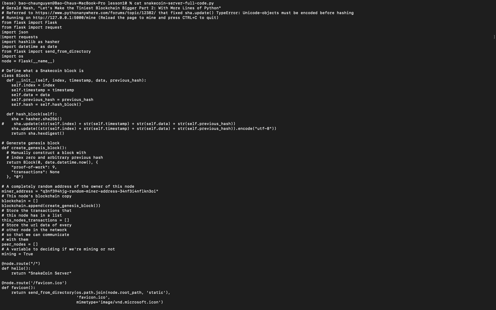
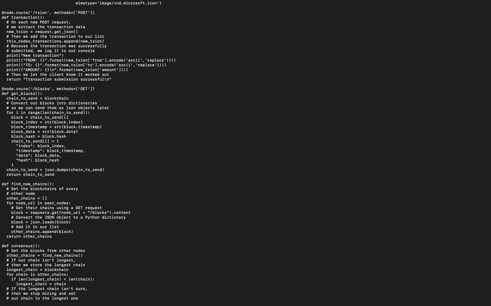
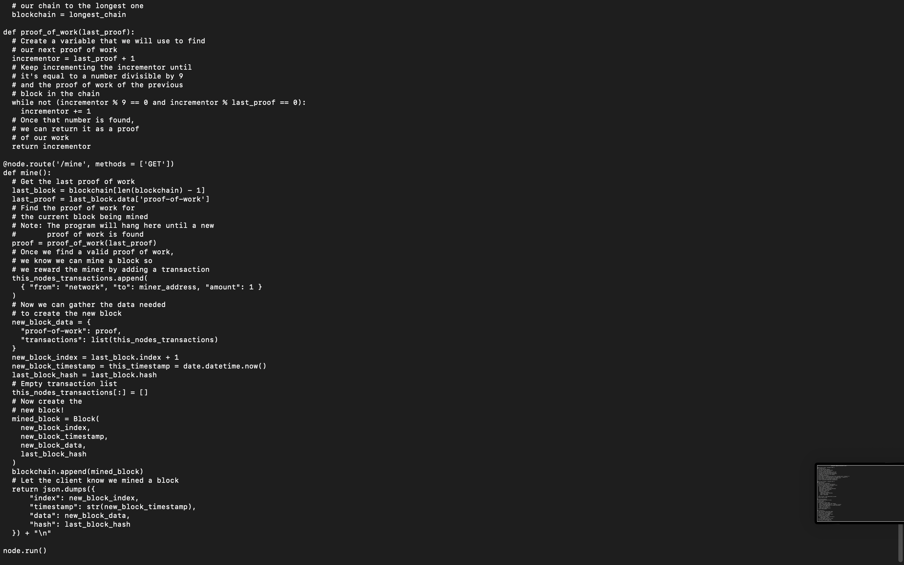

*python3 snakecoin-server-full-code.py*
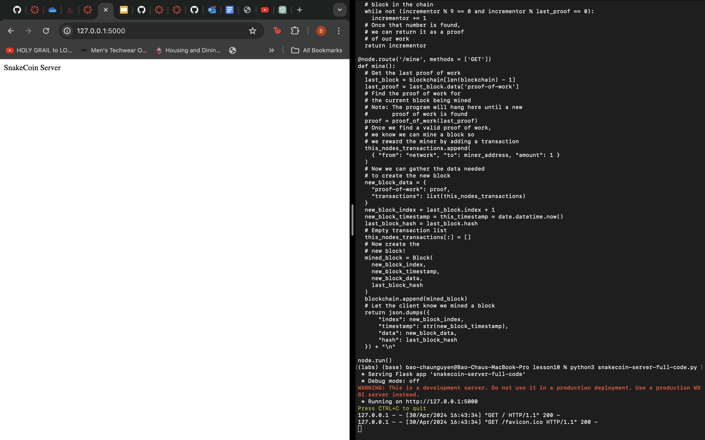

*Terminal 2*
>$ curl "localhost:5000/txion" \
>    -H "Content-Type: application/json" \
>    -d '{"from": "akjflw", "to":"fjlakdj", "amount": 3}'
>$ curl localhost:5000/mine

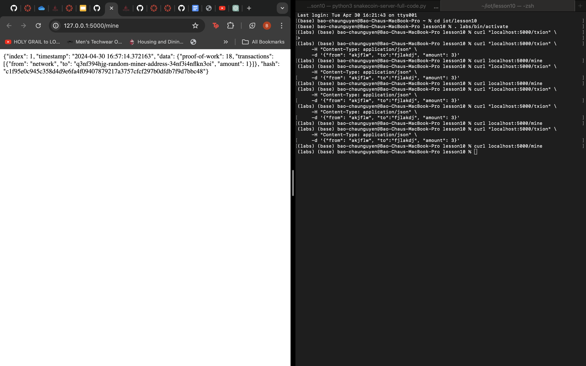

**Python blockchain app by Satwik Kansal**

*first two left screens outputs should be swapped for correct order*

*Terminal 1*
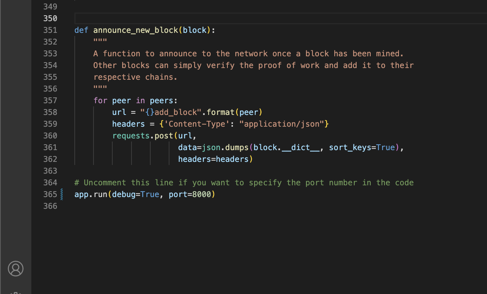
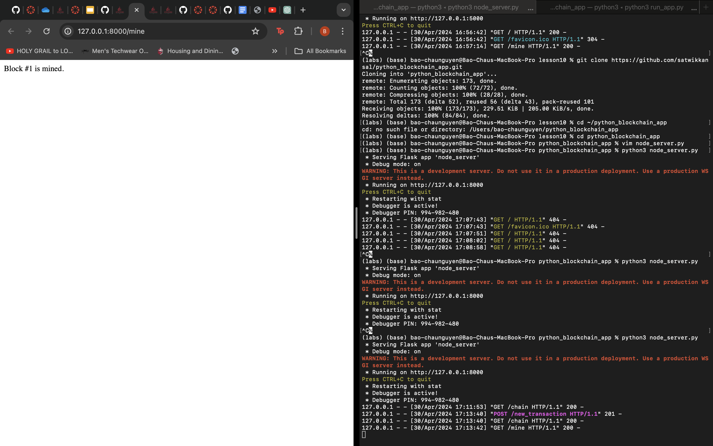

*Terminal 2*
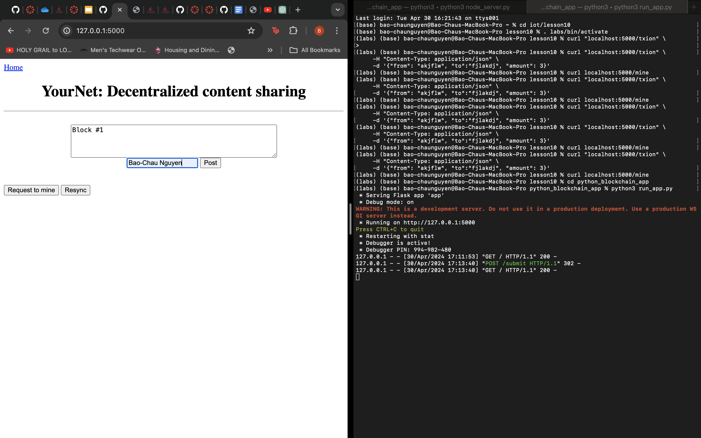
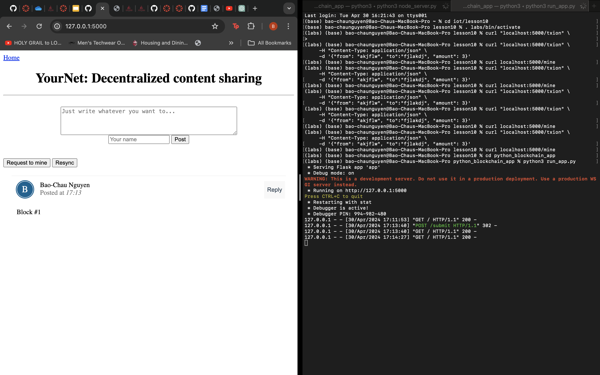

