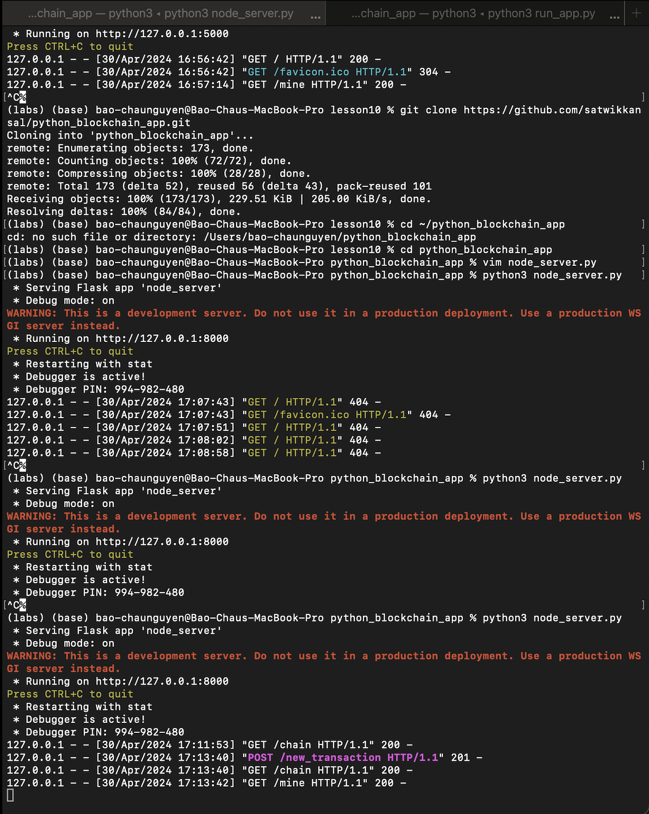
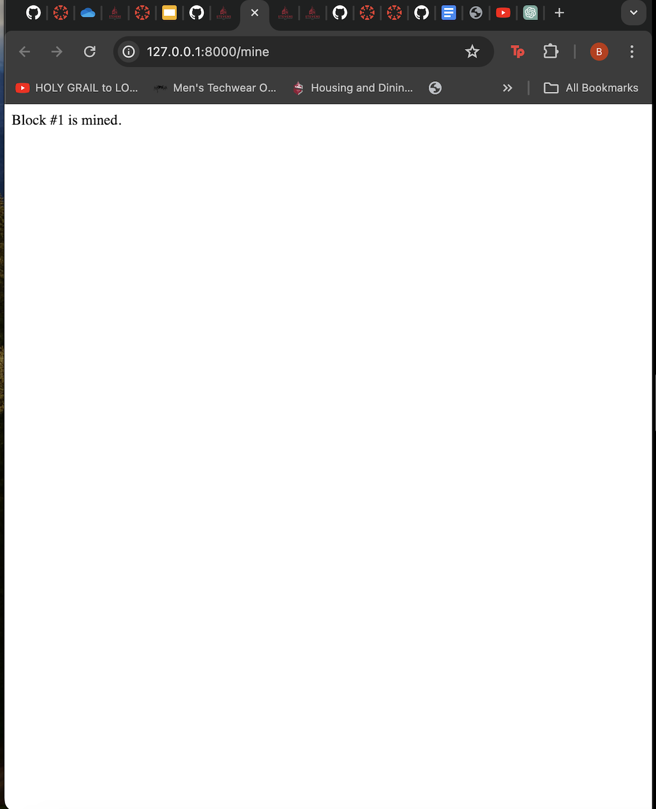

# Lab 10

**Run hash_value.py twice and compare results**

The first and second runs of the hash_value.py output the same values for 1, 1.0, and 3.4. However, the hash results for Python, 'a tuple of values,' and 'an object of a person' is different between the two hash_value.py runs.

**SHA-2 Secure Hash Algorithm**

**Build the tiniest blockchain in less than 50 lines of Python by Gerald Nash (2017-07-16)**

*cat snakecoin.py*

*python3 snakecoin.py*

**Let’s Make the Tiniest Blockchain Bigger Part 2: With More Lines of Python by Gerald Nash (2017-07-23)**

*Terminal 1:*

*cat snakecoin-server-full-code.py*

*python3 snakecoin-server-full-code.py*

*Terminal 2*
>$ curl "localhost:5000/txion" \
>
>    -H "Content-Type: application/json" \
>
>    -d '{"from": "akjflw", "to":"fjlakdj", "amount": 3}'
>
>$ curl localhost:5000/mine`

**Python blockchain app by Satwik Kansal**

*Terminal 1:Uncomment the last line of node_server.py (or search for port=8000) and run (Press Ctrl+C to quit)*

>$ git clone https://github.com/satwikkansal/python_blockchain_app.git
>
>$ cd ~/python_blockchain_app
>
>$ nano node_server.py
>
>$ python3 node_server.py

*Terminal 2:Run run_app.py (Press Ctrl+C to quit)*

>$ cd ~/python_blockchain_app
>$ python3 run_app.py

- Open a browser and go to YourNet running at http://127.0.0.1:5000/
- Enter content and name, click "Post," and click "Request to mine" that generate "Block #1 is mined" at http://127.0.0.1:8000/mine
- At YourNet, click "Resync" to view Block #1

