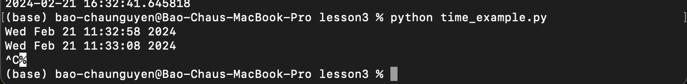

# Lab 3

**Students must enter in the following command lnes into the terminal**

- $ cd ~/iot
- $ cd *3
- $ python3 julian.py
- $ python3 date_example.py
- $ python3 datetime_example.py
- $ python3 time_example.py
- $ python3 sun.py "New York"
- $ python3 moon.py
- $ python3 coordinates.py "Samuel C. Williams Library"
- $ python3 address.py "40.74480675, -74.02532861159351"
- $ python3 cpu.py
- $ python3 battery.py
- $ python3 documentstats.py document.txt
---
**Here are the results of the command lines**

$ cd ~/iot, $ cd *3, and $ python3 julian.py

$ python3 date_example.py

$ python3 datetime_example.py

$ python3 time_example.py

$ python3 sun.py "New York"

$ python3 moon.py

$ python3 coordinates.py "Samuel C. Williams Library"

$ python3 address.py "40.74480675, -74.02532861159351"

$ python3 cpu.py

$ python3 battery.py

$ python3 documentstats.py document.txt

