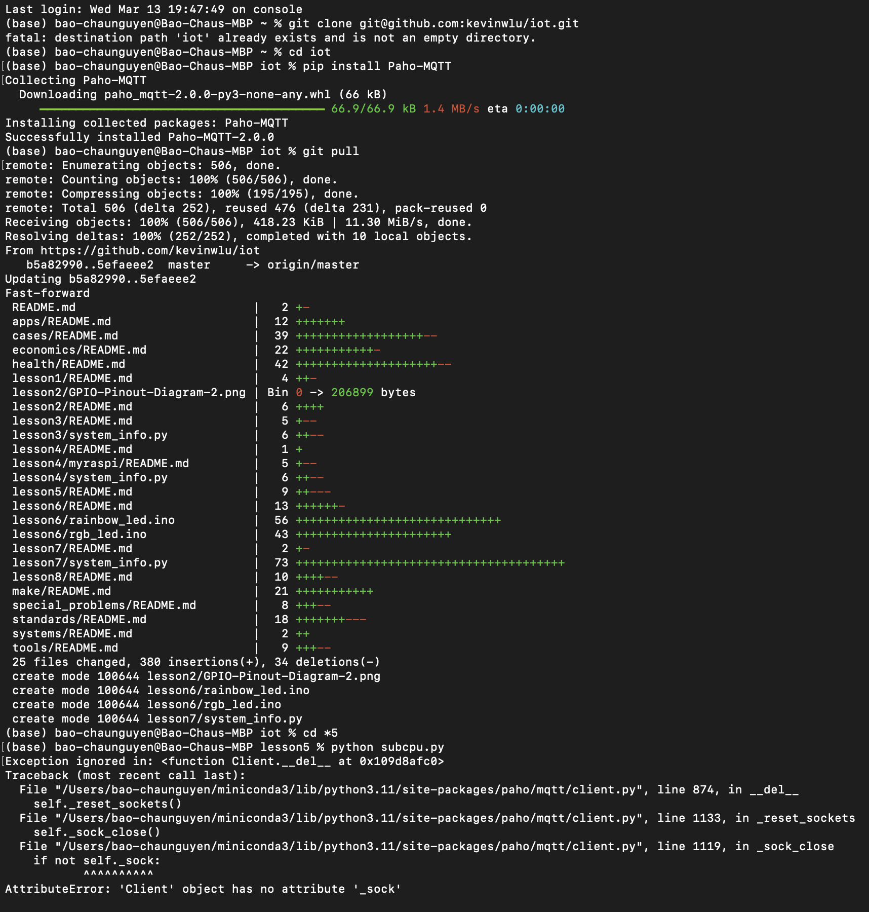
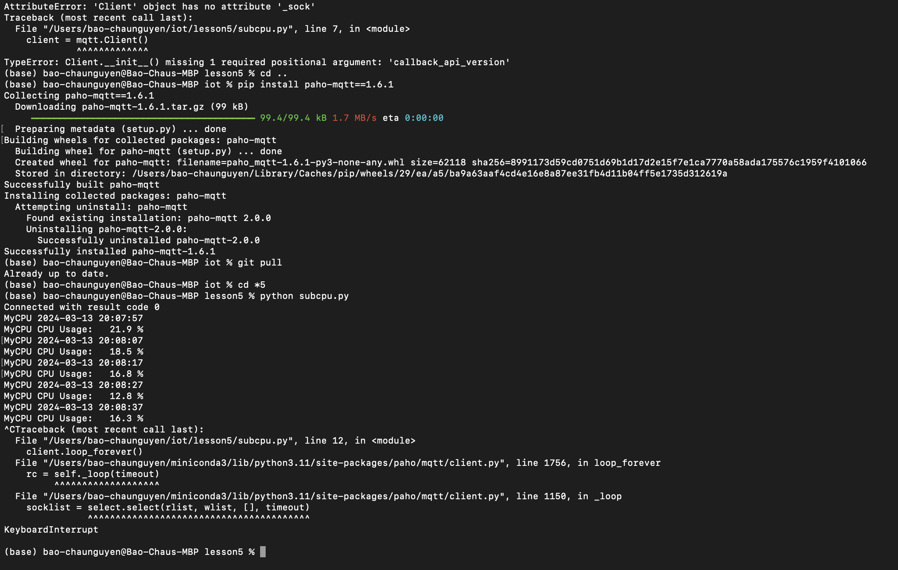
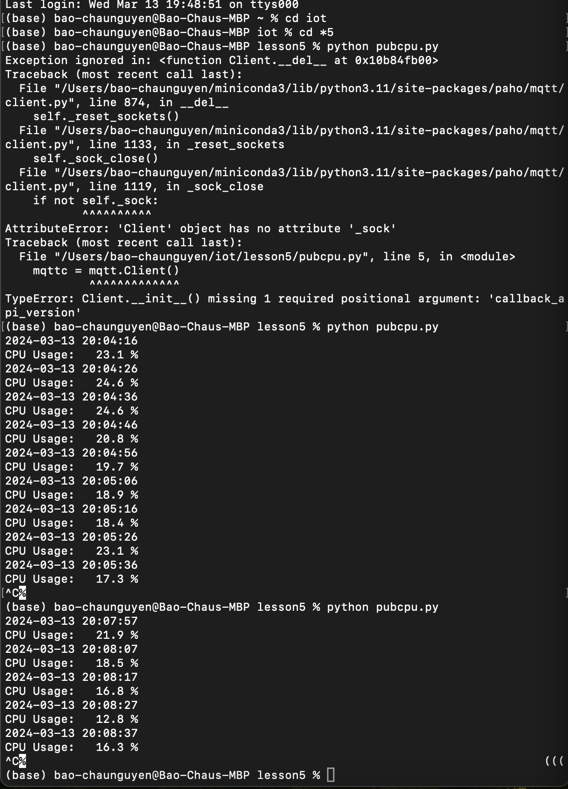

**For this lab, students were tasked with downloading PAHO-MQTT**

*Using this command "pip install PAHO-MQTT" did not work for me so instead the command "pip install paho-mqtt==1.6.1" was used*

*The following images show the work done in terminal 1*

*The following image shows the work done in terminal 2*

