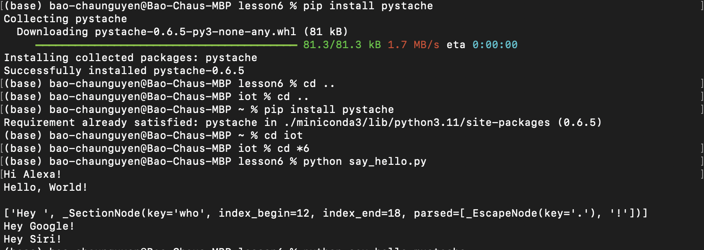

**For this lab, students were tasked with the following:**
1. Install Node.js and run hello-world.js, hello.js, and http.js
2. Install Pystache and run say_hello.py that uses the template in say_hello.mustache

These images depict the work done to complete task 1:

This image depicts the work done to complete task 2:

