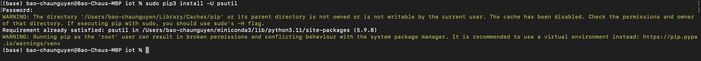
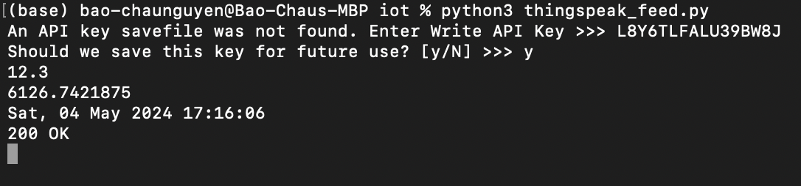
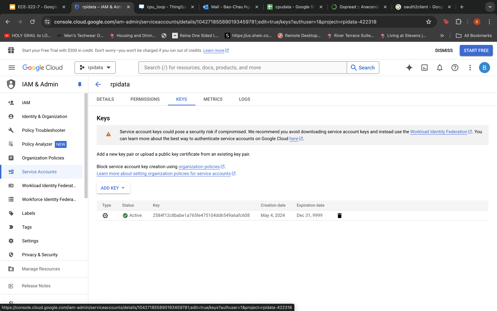
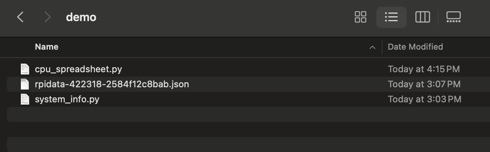

# Lab 7A: ThingSpeak

## Review and run thingspeak_feed.py

# Lab 7B: Google Sheets

## Sign up and log in the Google Cloud Platform Identity and Access Management (IAM)

## Install gspread and oauth2client

## Copy system_info.py and rpi_spreadsheet.py to ~/demo
## If the JSON key file (* = xxxxxxxxxxxx) is on a different computer, secure copy it to the same directory as rpi_spreadsheet.py

