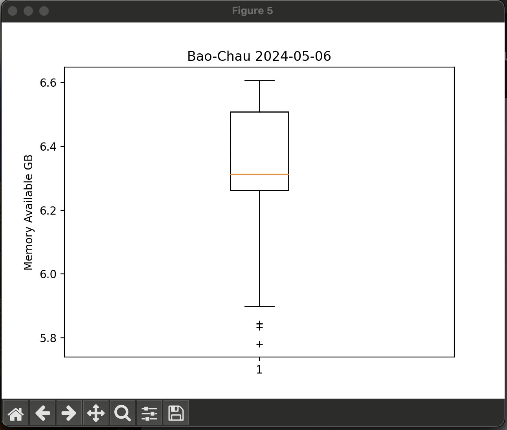
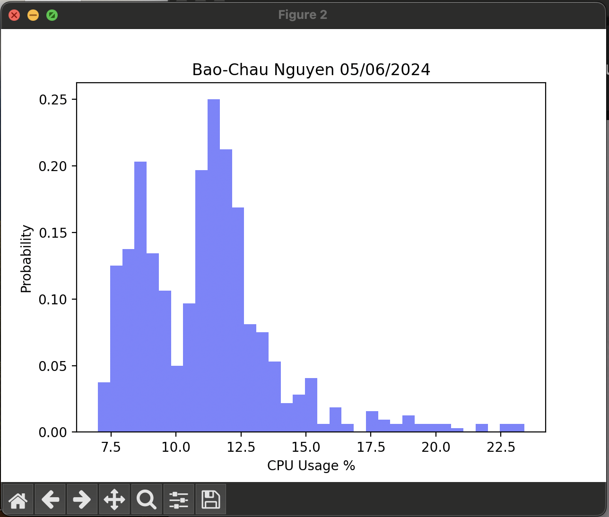

# Lab 8

## Install Python packages

## Save the Lab 7 Google sheet in CSV format to ~/demo

### cpudata.csv

## Copy ~/iot/lesson8/plt_final.py and plt_cv2.py to ~/demo

## Run plt_final.py

### Scatter Diagram with Linear Regression Line

### Vertical Box Plot of Memory

### Horizontal Box Plot of CPU Usage

### Histogram of Memory

### Histogram of CPU Usage

### Time Series

## Run plt_cv2.py

